# YapGitsin - Mobil Uygulama

YapGitsin, kullanıcıların çeşitli yemek tariflerini keşfetmelerini ve favori tariflerini kaydetmelerini sağlayan modern bir mobil uygulamadır. Android için geliştirilmiştir ve **Light / Dark** tema desteği ile **Türkçe ve İngilizce dil desteği** sunar.

## Özellikler / Features
- **Kullanıcı kimlik doğrulama**: Supabase Auth kullanılarak güvenli giriş ve kayıt sistemi  
- **Şifre sıfırlama**: Supabase üzerinden e-posta ile şifre sıfırlama desteği  
- **Tarif listesi ve filtreleme**: Meals API kullanılarak tariflerin çekilmesi ve kategori / malzeme bazlı filtreleme  
- **Favorilere ekleme ve yönetim**: Kullanıcının favori tariflerini Supabase Storage veya veritabanında saklama  
- **Profil yönetimi**: Kullanıcı bilgilerini görüntüleme ve güncelleme  
- **Modern UI**: Jetpack Compose ile responsive ve reaktif kullanıcı arayüzü  

## Ekran Görüntüleri

### Light Mod

<table>
  <tr>
    <td>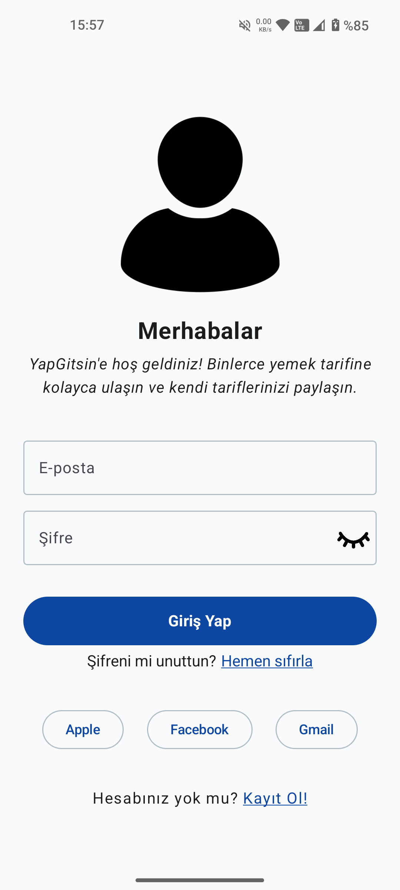 Giriş</td>
    <td>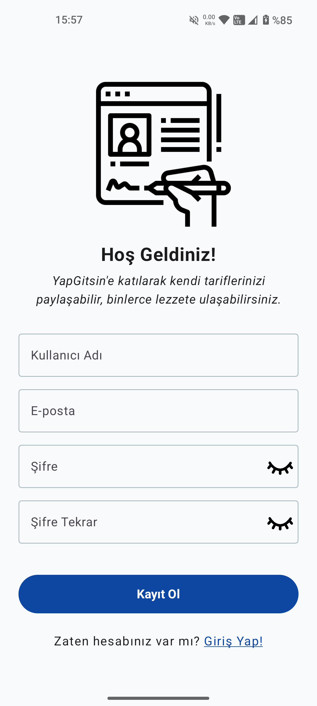 Kayıt</td>
    <td>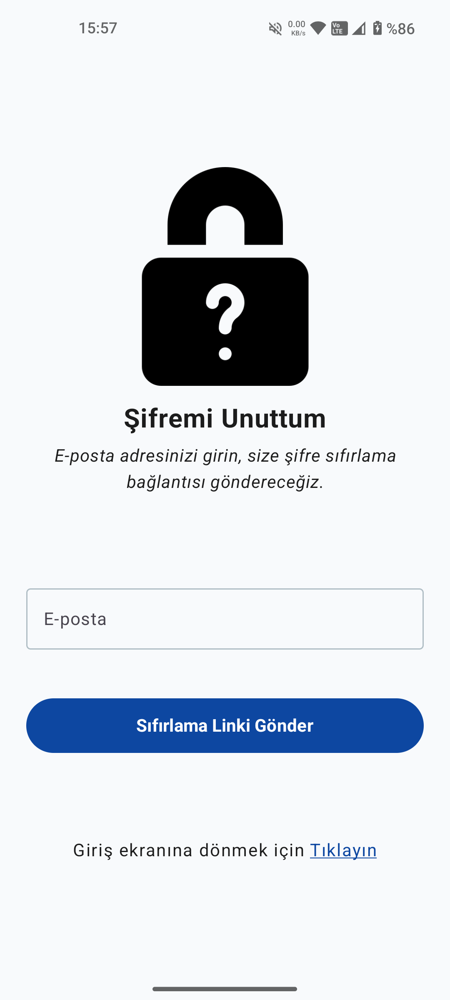 Şifre Sıfırlama</td>
  </tr>
  <tr>
    <td>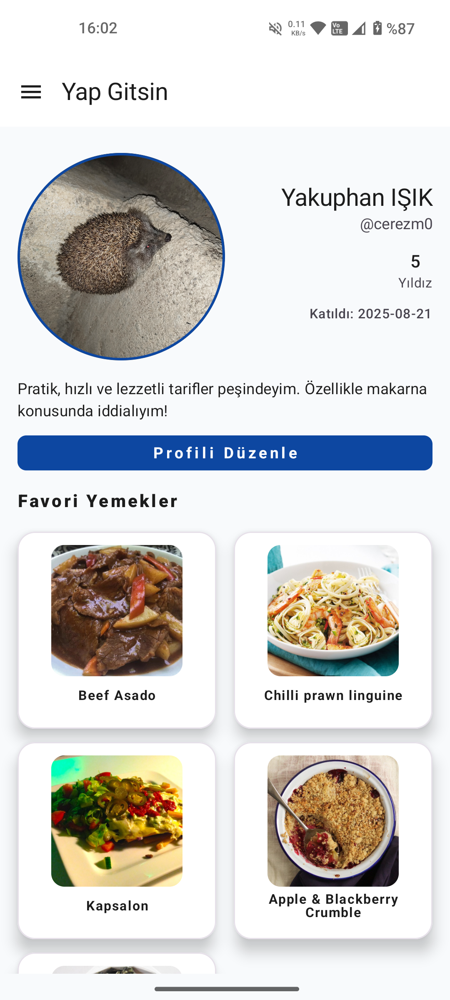 Profil</td>
    <td>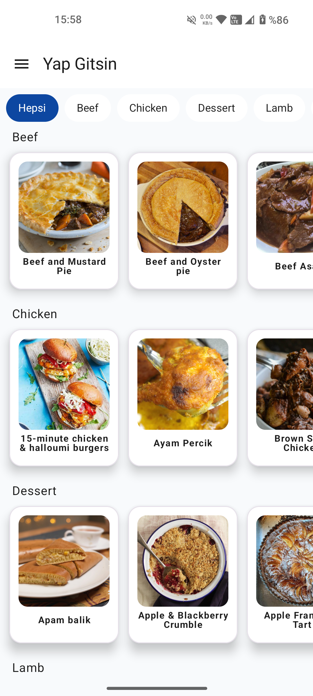 Yemekler</td>
    <td>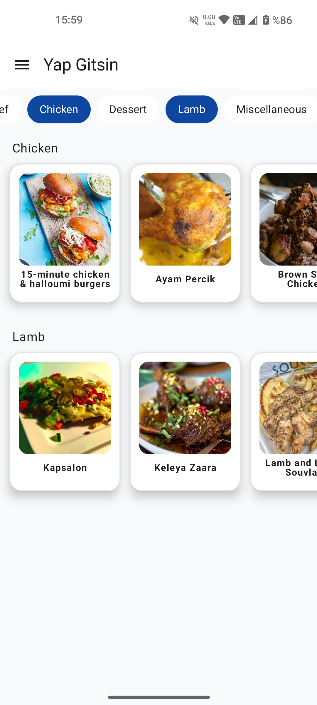 Filtreleme</td>
    <td>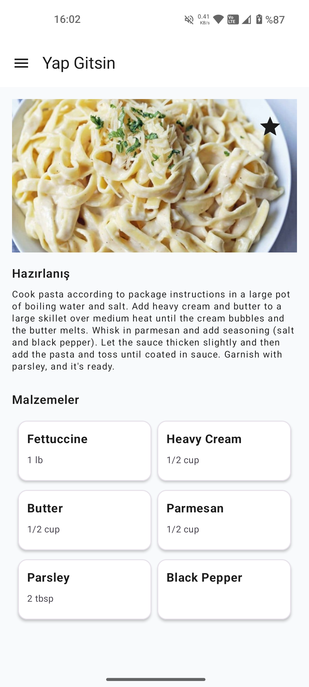 Detay</td>
  </tr>
</table>

### Dark Mod

<table>
  <tr>
    <td>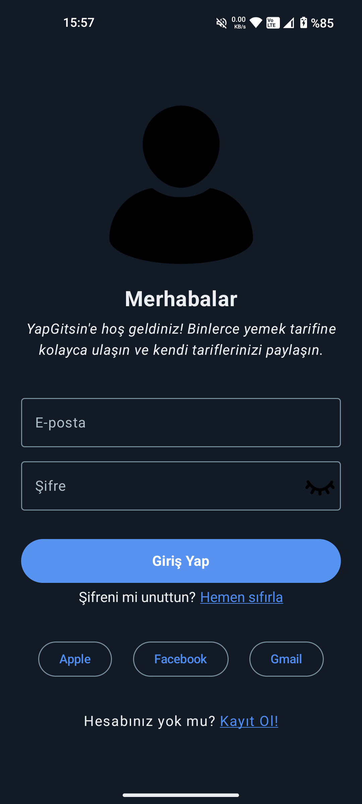 Giriş</td>
    <td>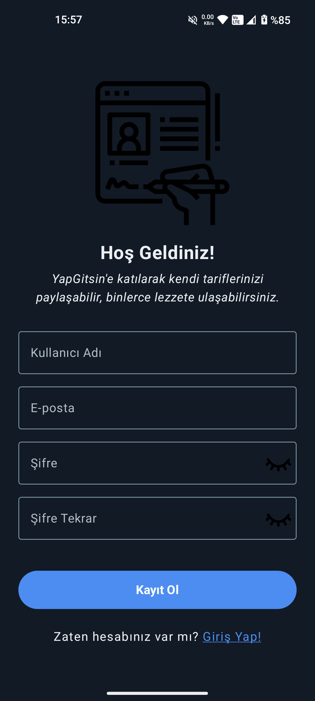 Kayıt</td>
    <td>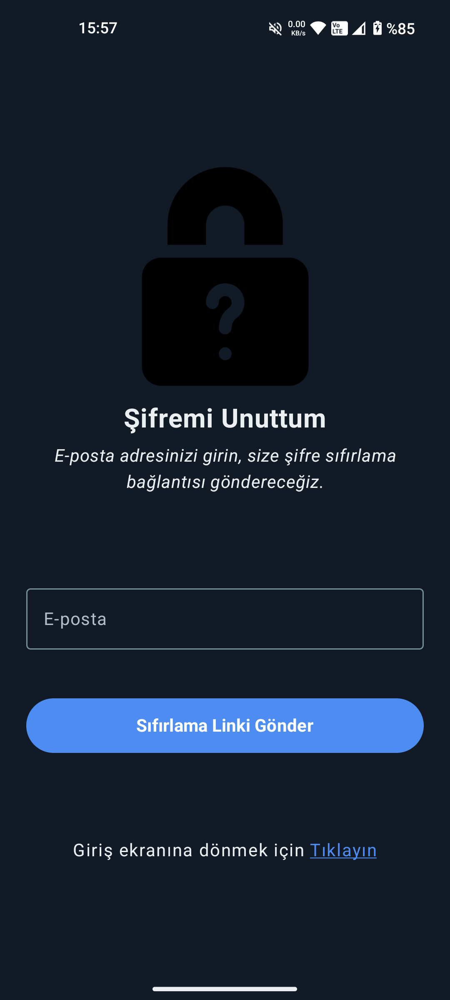 Şifre Sıfırlama</td>
  </tr>
  <tr>
    <td>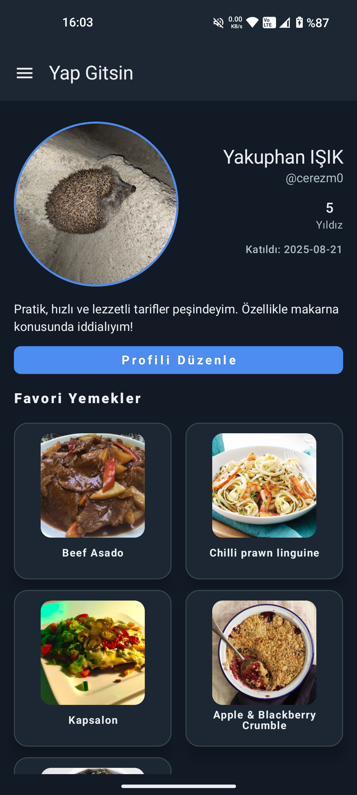 Profil</td>
    <td>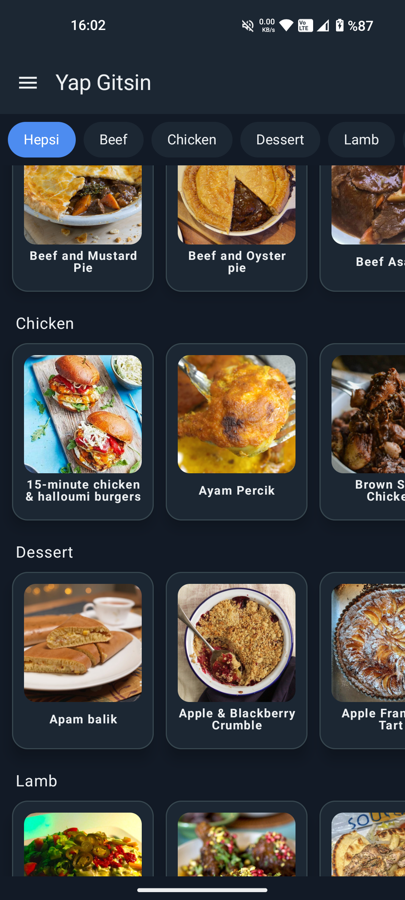 Yemekler</td>
    <td>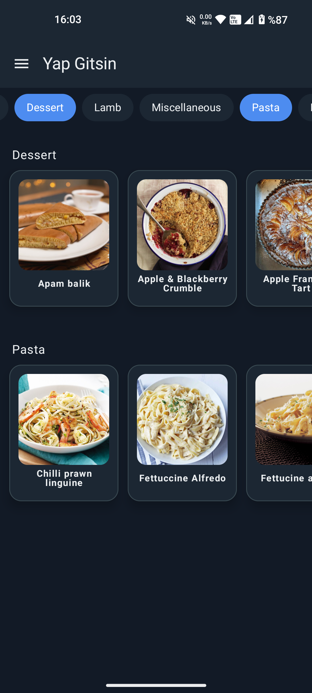 Filtreleme</td>
    <td>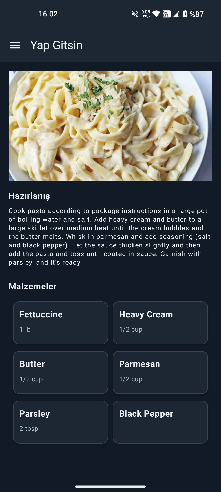 Detay</td>
  </tr>
</table>

## Teknolojiler / Technologies
- **Kotlin**  
- **Jetpack Compose**  
- **MVVM Mimarisi**  
- **Hilt** (Dependency Injection)  
- **Jetpack Navigation** (Compose için ekranlar arası geçiş)  
- **Supabase** (Backend ve veri yönetimi) 
